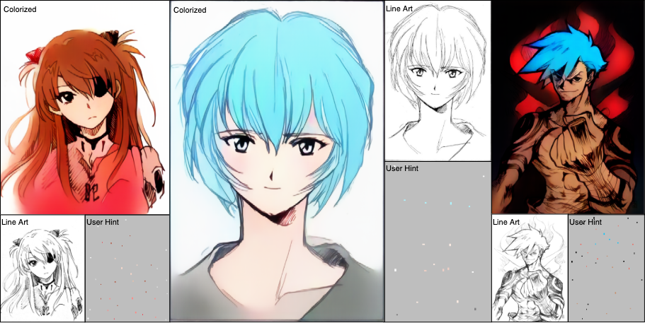
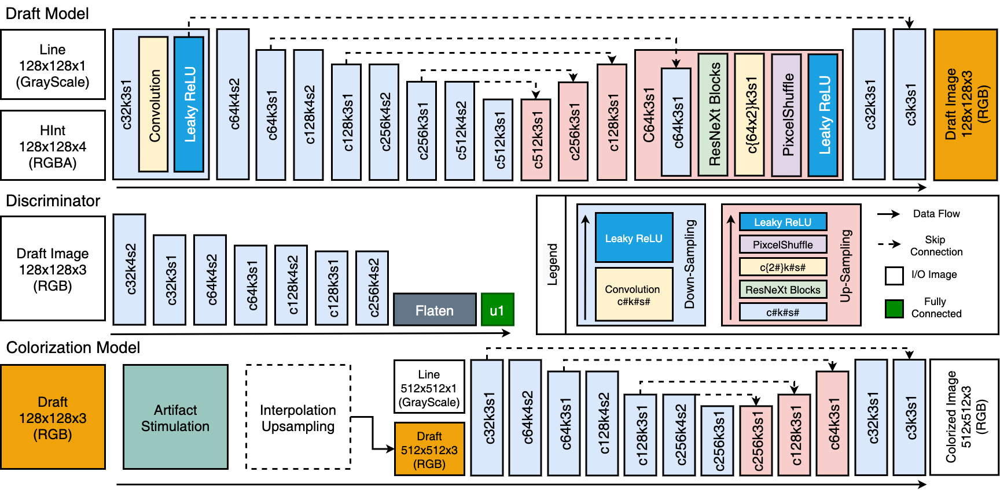
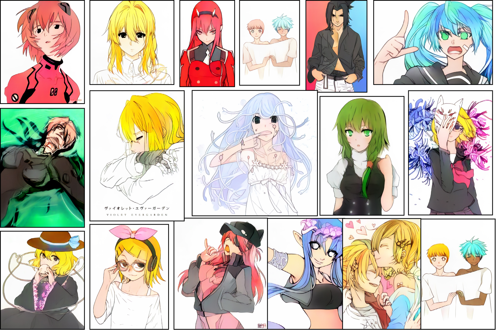
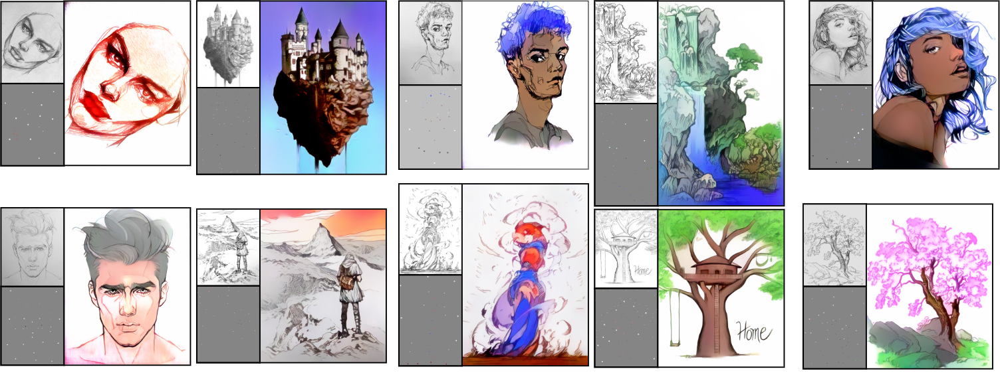
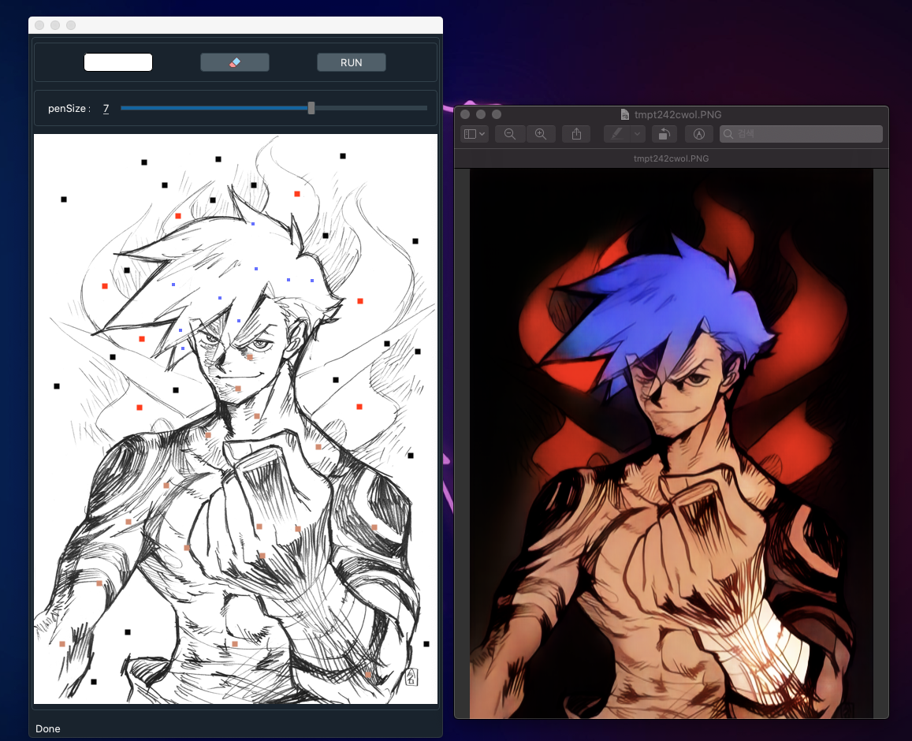

# SketchColorization

# Model Structure 

# Samples

# GUI

---

# Requirements

- torch==1.7.1
- torchvision==0.82
- numpy==1.19.1
- tensorboard==2.3.0
- tqdm==4.28.1
- opencv_python==4.4.0.46
- scipy==1.5.2
- Pillow==7.2.0
- scikit-learn==0.23.2
- fbs==0.9.0
- onnx==1.7.0
- onnxruntime==1.5.1
- PyQt5==5.15.1
- QDarkStyle==2.8.1

# Dataset 
- We crawled over 700,000 illustrations from [shuushuu-image-board](https://e-shuushuu.net/) and used them for learning.

- We have filtered out noise such as extreme aspect ratio, black and white image, low / high key images and etc.

# Training

- The learning sequence is 1. autoencoder, 2. draft, 3. colorization.

- set hyperparameters.yml, e.g. paths (image_path and line_path, logdir)

- Start learning after adjusting hyperparameters for each learning step

    - run 'python main.py  -M {autoencoder | draft | colorization}'

# Run APP with source code

- download pretrained onnx model (SketchColorizationModel.onnx)
- Copy model to "app/src/main/resources/base/SketchColorizationModel.onnx"
- cd app 
- fbs run 